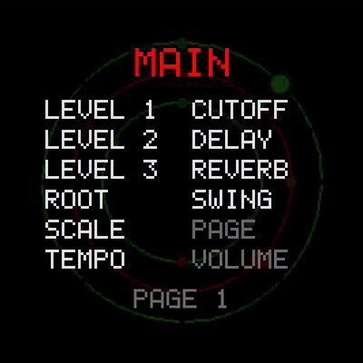
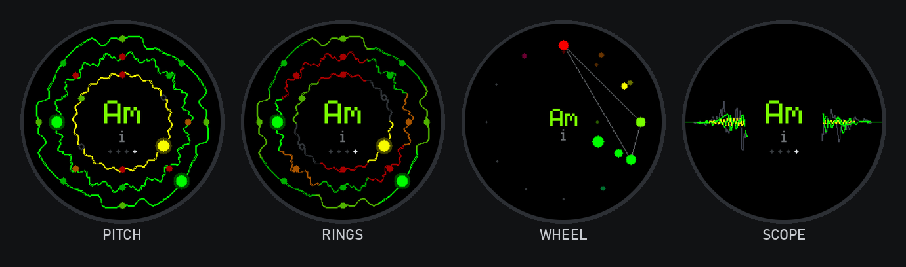
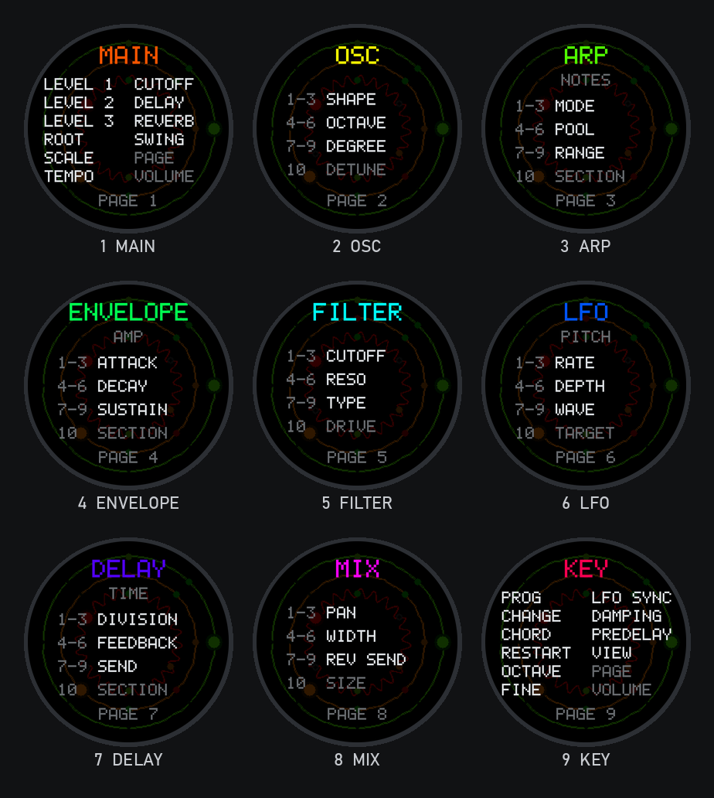
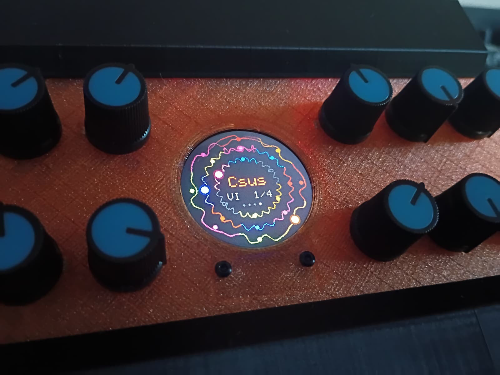
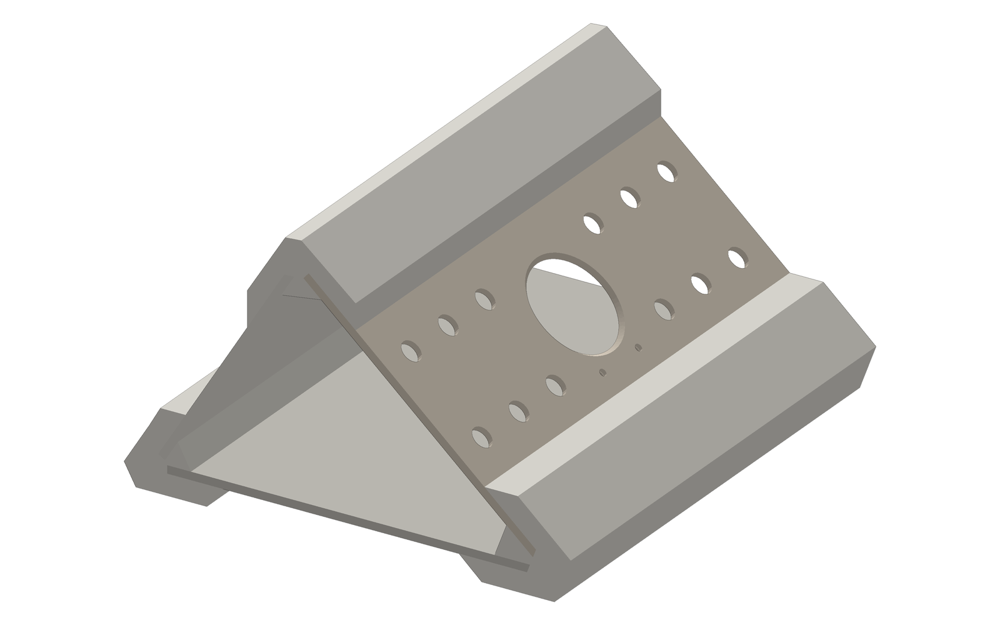

<p align="center">
  
</p>

<h1 align="center">Ammonite</h1>

<p align="center">
  <b>A three-voice arpeggiator synthesizer on the Daisy Seed</b><br>
  12 knobs &middot; a round screen that draws the music &middot; chords, polyrhythms and echoes in one small box
</p>

<p align="center">
  <a href="https://gsnautilus.github.io/ammonite/#listen"><b>&#9654; Listen: two minutes of Ammonite</b></a><br>
  <a href="https://gsnautilus.github.io/ammonite/#video">Watch the screen play (video with sound)</a> &middot;
  <a href="manual/Ammonite_Manual.pdf">Owner's manual (PDF)</a>
</p>

---

Ammonite is three monophonic synth voices, each with its own arpeggiator, envelopes,
filter, five LFOs and stereo echo, all locked to one master clock and one key. You never
pick notes: you pick a key, a chord progression and, for each voice, which notes of the
chord it may play and in what rhythm. Everything it plays is in key, and the three
patterns can run at different lengths and speeds without ever drifting apart.

The round screen shows the three arps as rings: each ring is that voice's real waveform,
cut into its steps, with every note in its own color (the colors follow the circle of
fifths, so a chord has a look as well as a sound).

- **Three voices**, each two detuned oscillators morphing sine / square / saw
- **Three arpeggiators**: 6 modes, 5 note pools, 1-3 octaves, 9 divisions incl. triplets,
  1-16 step patterns, Euclidean density, random note variation, ratchets
- **Harmony**: 10 scales and 10 chord keys, 8 chord progressions, manual chords
- **Per voice**: amp, filter and pitch envelopes, glide, a morphing LP/BP/HP filter,
  15 LFOs in all (pitch, cutoff, amp, pan, shape), a tempo-synced stereo delay
- **Shared**: drive, reverb, swing, four screen views
- **No menus**: nine pages of knobs, one column per voice

## Listen

**[&#9654; Two minutes of Ammonite](https://gsnautilus.github.io/ammonite/#listen)**

That and every clip below play in your browser on the
[listening page](https://gsnautilus.github.io/ammonite/). The recipes are rendered
straight from the synth engine, 40 seconds each; every one is in the
[owner's manual](manual/Ammonite_Manual.pdf), so you can dial it in yourself.

| | |
|---|---|
| [Power-on](https://gsnautilus.github.io/ammonite/#power-on) | what Ammonite plays the moment it has power: three arps in A minor |
| [Slow tide](https://gsnautilus.github.io/ammonite/#tide) | three drones sliding through a progression under a breathing filter |
| [Clockwork](https://gsnautilus.github.io/ammonite/#clockwork) | sixteenth-note patterns of 8, 7 and 5 steps turning against each other |
| [Dub echoes](https://gsnautilus.github.io/ammonite/#dub) | a sparse chord stab into a dark, wobbly ping-pong echo over a sine bass |
| [Late set](https://gsnautilus.github.io/ammonite/#jazz) | a swung ii-V-I in C with a gliding bass |
| [Bells in D](https://gsnautilus.github.io/ammonite/#bells) | Pachelbel's chords played by pitch-swept sine bells |

## The screen

<p align="center"></p>

Turn a knob and the screen shows what it is and its value; turn the page knob and it
shows what every knob on the new page does:

<p align="center"></p>

## Hardware

<p align="center"></p>
<p align="center"><i>The front panel, assembled and playing.</i></p>

<p align="center"></p>
<p align="center"><i>The printed enclosure, version 1.</i></p>

Version 1 of the hardware is simple, and meant to be built with a soldering iron and a
breadboard:

- an Electrosmith **Daisy Seed3**
- a **GC9A01 1.28" round 240x240 display**, 7-pin SPI module
- **12 x WH148 B10K** linear potentiometers (15 mm shaft) with knobs
- a 3.5 mm stereo jack for the output, a breadboard and jumper wire
- a **3D-printed enclosure**: six parts in [`hardware/stl`](hardware/stl)
- USB-C for power and flashing

The wiring is in [`hardware/wiring`](hardware/wiring). A full hardware manual (parts,
printing, assembly, wiring, flashing) is on the [to-do list](#to-do); the enclosure will
keep changing (side panels, a proper home for the jack), so treat this as version 1.

## Getting started

### Flash the firmware

1. Download `ammonite.bin` from the [latest release](../../releases/latest).
2. Put the Seed in bootloader mode: hold **BOOT**, tap **RESET**, release **BOOT**.
3. Open the [Daisy Web Programmer](https://flash.daisy.audio/) in Chrome or Edge, connect,
   choose the file and flash.

### Build from source (Windows)

You need the [Daisy toolchain](https://github.com/electro-smith/DaisyToolchain/releases)
and [Git for Windows](https://gitforwindows.org/). In PowerShell:

```powershell
git clone --recursive https://github.com/GSNautilus/ammonite
cd ammonite
.\ammonite.ps1 libs     # once: builds libDaisy and DaisySP
.\ammonite.ps1 build    # firmware\build\ammonite.bin
.\ammonite.ps1 flash    # build and flash over USB (bootloader mode first)
```

### Try it without hardware

The PC simulator runs the exact same engine and draws the exact same screen, with the
panel's twelve knobs under your mouse. It needs Python 3.11 with the packages in
[`requirements.txt`](requirements.txt):

```powershell
pip install -r requirements.txt
.\simulator.bat
```

(If the right `python` is not on your PATH, set `AMMONITE_PYTHON` to its `python.exe`.)
`.\ammonite.ps1 test` runs the engine's 193 headless checks.

### A plugin?

A VST3 / CLAP version for Windows is planned (see the to-do list).

## To do

- [ ] **Hardware manual**: parts list, printing, assembly, wiring and flashing, with photos
      of the build
- [ ] **Enclosure v2**: back and side panels with room for the jack and USB
- [ ] **Measure CPU load on the Seed** with every effect running
- [ ] **VST3 / CLAP plugin** for Windows, synced to the DAW's tempo

## Repository

| Folder | |
|---|---|
| `core/` | the synth engine: portable C++14, no hardware code. Everything musical lives here |
| `firmware/` | the thin Daisy shell: knobs in, audio and screen out |
| `sim/` | the PC simulator (Python + the engine as a DLL) |
| `tests/` | headless tests that play the engine and measure what comes out |
| `manual/` | the owner's manual: its screen captures are made by driving the engine |
| `hardware/` | enclosure STLs and wiring diagrams |
| `media/` | everything on this page, rendered by `media/make_media.py` |
| `docs/ENGINE_PLAN.md` | the design and build notes |
| `lib/` | libDaisy and DaisySP (git submodules) |

## License

Ammonite is released under the [MIT license](LICENSE).

It builds on Electrosmith's [libDaisy](https://github.com/electro-smith/libDaisy) and
[DaisySP](https://github.com/electro-smith/DaisySP) (MIT). The reverb, `ReverbSc`, comes from
[DaisySP-LGPL](https://github.com/electro-smith/DaisySP-LGPL) and is licensed under the
**LGPL-2.1**; it is linked into the firmware and the simulator, and its full source is
included here as a submodule.
